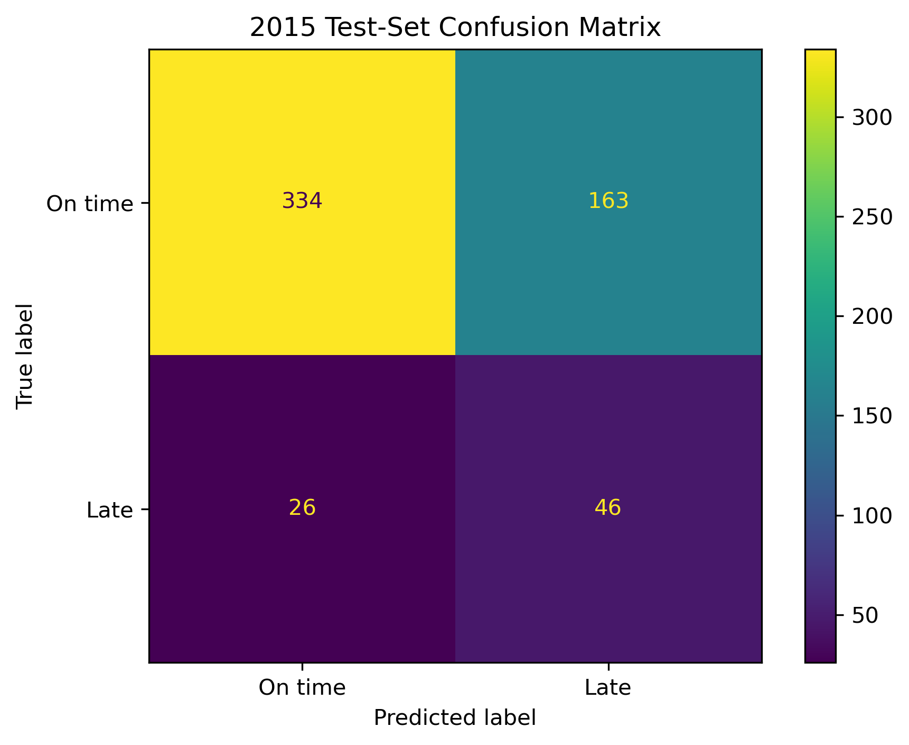
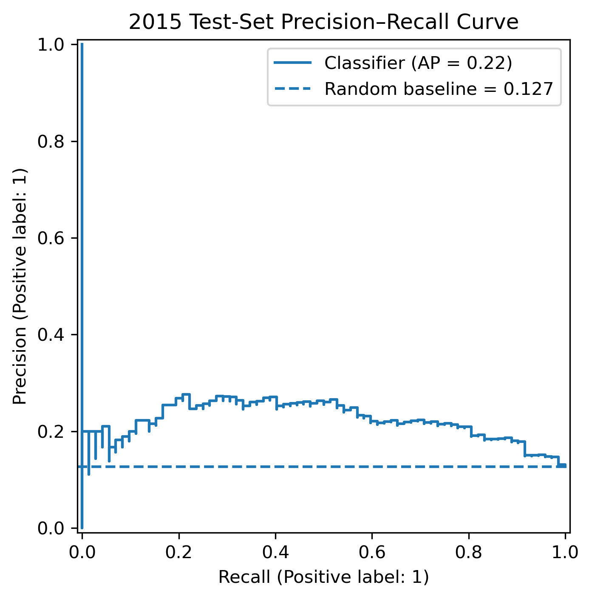
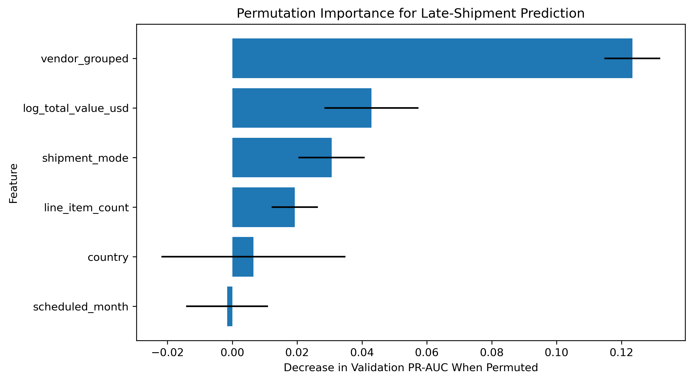

# Global Health Supply Chain Delivery Analytics

## Business Question

Which vendors, shipment modes, and destinations show the greatest delivery reliability concerns, and can historical shipment information identify deliveries at elevated risk of arriving late?

## Project Overview

This project analyzes global health shipments using PostgreSQL, Tableau, and machine learning to identify delivery risks and predict late shipments.

- Cleaned 10,324 shipment line items and aggregated them into 7,030 shipments
- Used SQL CTEs, window functions, rankings, and analytical views
- Compared vendor, shipment-mode, destination, and yearly performance
- Built a late-shipment classifier using only information available before delivery

## Project Links

- [Interactive Tableau Dashboard](https://public.tableau.com/app/profile/salome.ho8129/viz/GlobalHealthSupplyChainDeliveryAnalytics/GlobalHealthySupplyChainDeliveryPerformance)
- [Late Shipment Classifier Notebook](modeling/01_late_shipment_classifier.ipynb)

## Data Sources

- SCMS Delivery History Dataset

## Tools

PostgreSQL, SQL, Docker, Python, Pandas, scikit-learn, Matplotlib, Jupyter Notebook, Tableau Public

## Key Findings

- Overall on-time rate: 88.63%
- Air had the highest known-mode reliability: 91.45%
- Truck had the lowest on-time rate: 79.36%
- Late Ocean shipments averaged 41.12 days late
- Aurobindo Ocean shipments were 73.08% on time
- CIPLA Ocean shipments were 77.78% on time
- Congo, DRC and South Africa were high-priority destination concerns

## Late-Shipment Classifier

Logistic regression and histogram-based gradient boosting were compared on the validation set; gradient boosting performed marginally better and was used for final testing.

The data was split chronologically:

- Training: 2006–2013
- Validation: 2014
- Test: 2015

| Metric | 2015 Test Result |
|---|---:|
| ROC-AUC | 0.714 |
| PR-AUC | 0.223 |
| Precision | 22.0% |
| Recall | 63.9% |
| F1 | 0.327 |

Reviewing the highest-risk 36.7% of shipments captured 63.9% of late deliveries. The model is intended as a prioritization tool, not an automated decision system.

## Model Results

## Recommendations

- Review Aurobindo Pharma and CIPLA's Ocean shipments (73–78% on-time) - the weakest vendor-mode combinations found.
- Treat SCMS from RDC's Truck route as an internal process issue, not a vendor performance problem.
- Use the classifier to flag the highest-risk 36.7% of shipments for manual review, while considering its precision-recall tradeoff of 22.0% precision and 63.9% recall.

## Limitations

- Numeric freight cost was available for 6,198 of 7,030 shipments. Some remaining records indicated that freight was included in commodity cost, invoiced separately, or recorded under another shipment identifier.
- "SCMS from RDC" was reclassified as an internal distribution source rather than an external vendor, since including it as a vendor would have distorted vendor comparisons.
- The dataset ends in 2015 and does not include every factor that may affect delivery, such as customs, infrastructure, emergencies, or contract terms. Results show historical associations, not causation.

